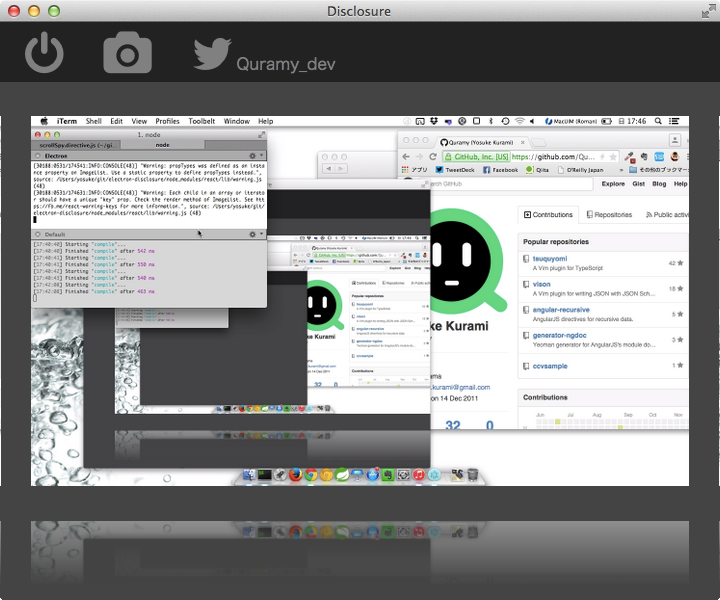

# electron-disclosure

This is a sample application with [github Electron](http://electron.atom.io/).

It captures your desktop by 5 minutes and posts tweet with the captured images.
(Don't worry, post tweets requires your authentication)



## Run

```sh
npm install -g electron-prebuilt bower gulp
cd electron-disclosure
npm install
npm start
```
